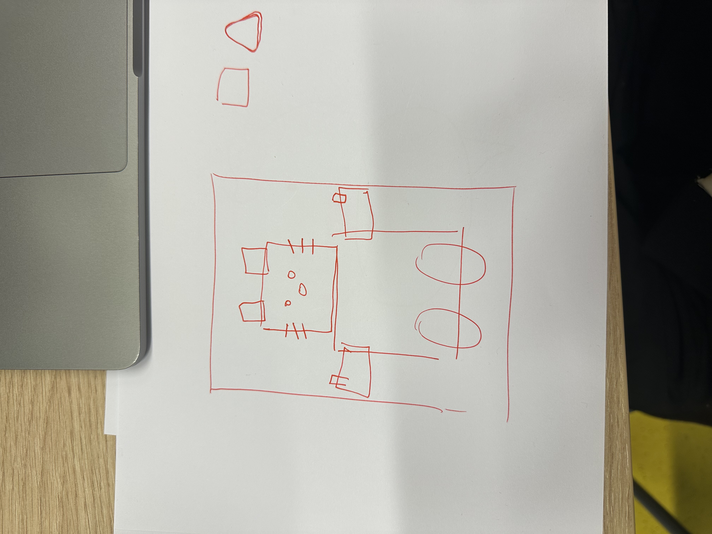

# cssttr

CSS to the resue. 
Maandag zijn we begonnen met onderzoeken van een bepaald onderwerp, hier heb ik met een groep onderzoek gedaan naar anchors en wat bij anchors hoort. Hierbij heb ik mij ingelezen over de details en summary tags. 
Vervolgens hebben we dit gepresenteerd en dus ook gekeken naar wat de andere teams hebben onderzocht. 
Dinsdag ben ik begonnen met het kiezen van de opdracht, het maken van een control panel die iets bestuurt. Hierbij was mijn idee om een hello kitty te ontwerpen via css en deze als het ware op een wereldbolletje te zetten om haar acties te laten uitvoeren. 
- via een knop de kleur van haar kleding kan veranderen 
- creeëren van een light en darkmode die de omgeving van haar veranderd. 
- Ten eerste wil ik het begin van de avatar opgezet hebben om vanuit hier door te kunnen bouwen. 

Vervolgens ben ik gaan proberen om een eerste versie te maken via css, vanaf dinsdag ben ik tot een eerste opzet gekomen van het hoofd van Hello kitty, als zij helemaal af is kan ik de volgende elementen gaan toevoegen 

# Week 2:
 Hele poppetje staat nu zoals ik wil, dus nu kan ik gaan beginnen met zorgen dat de controls ook iets gaan bedienen en beginnen met animeren 

# Week 3:
 Het gehele poppetje wat actie moet gaan uitvoeren is nu onderweg. Veel nieuwe dingen geprobeerd en vooral met behulp van has()

 Ik heb een aantal buttons gecreeërd om te gebruiken als control voor de kleur van haar shirt. 
 Heb ik een groep met radio buttons neergezet en deze vervolgens gestyled om te laten zien welke kleuren mogelijk zijn voor haar shirt. 
 Door has() kan ik aangeven dat als een button ingdrukt is, er iets anders gaat gebeuren. 

 Vervolgens wilde ik graag een light-dark mode inbrengen. Deze wordt ook aangeroepen door has en is gemaakt door een checkbox te gebruiken en deze vervolgens ook te stylen en deze er als een slider uit te laten zien. 

 

 

Om aan te werken:
 - De ruimte om deze controls heen zal ik nog gaan stylen om er echt een gevoel van een control panel aan te kunnen geven. 
 - Misschien een animatie toevoegen aan de light, darkmode 
 - een animatie toevoegen waardoor het wereldbolletje gaat draaien en er elementen komen of verschijnen 
 - werken met de typografie van de titel, dat deze iets meer meedoet aan het gevoel van de pagina

Afronding: 
In de laatste week en paar dagen heb ik nog een aantal grote stappen kunnen zetten, in het laatste gesprek zag ik ook dat de content die in de pagina stond goed was en goed werkte alleen het was vrij statisch en er gebeurde vrij weinig. 
- Afgelopen dagen heb ik eerst de indeling van mijn html even goed bekeken en gereorganiseerd. Ik kwam erachter dat als ik wilde gaan animeen dat dit lastig zou gaan omdat niet alles in een zelfde element zat waardoor het niet als één geheel zou gaan bewegen. Toen heb ik ervoor gezorgd dat dus de oren in het hoofd vallen en de armen in het lichaam zodat alles een geheel word. Dit was nog even een gedoe en moest ik veel CSS gaan aanpassen omdat veel elementen niet meer goed aangesproken werden. Maar toen dit opgelost was kon ik gelukkig makkelijk gaan beginnen met animeren. 
- vervolgens ben ik aan de slag gegaan met de style queries die voor mij nog best lastig waren. Om deze te testen ben ik begonnen met een variable aan te maken en deze een kleur te geven als iets aanpast om te bekijken. Na veel uitproberen en nadenken is het gelukt om dat wanneer de waarde van de input voor het shirt veranderd er verschillende dingen gebeuren. 
- Ook heb ik een zon en maan ingevoegd en de maan die met een animatie op komt voor meer een gevoel van nacht
- een passende typografie voor de pagina die ook mee schaalt 

Eindproduct: 
Na veel dingen proberen en tegen mezelf aanlopen heb ik naar mijn idee een leuk control panel die verschillende dingen kan aanroepen. - Met behulp van style queries en het proberen en aanmaken van variable om een functie te kunnen aanroepen heb ik er voor gezorgd dat er een animatie kan komen wanneer er een bepaalde input wordt aangeroepen. 
- Met behulp van media queries heb ik ervoor gezorgd dat sommige elementen kleiner worden als het scherm dit ook wordt zodat het goed in verhouding blijft 
- de animatie met een bepaalde kleur is gelukt 
- met behulp van has krijgt de background een andere waarde

# Aanvulling

## Hello kitty 
Toen ik begon aan dit project had ik wel wat ervaring met het werken met css maar ook niet extreem veel dus het was veel nieuwe dingen uitproberen. Zo heb ik eerst veel nagedacht over hoe ik dit wilde gaan maken en zo wordt het voor mij spannender om te starten omdat het soms als erg veel kan lijken dat ik niet weet waar ik moet beginnen. Vooral omdat ik nog nooit zoveel vormen had gemaakt met puur css. Maar stapje voor stapje werd het toch beter. Ik koos voor elk element in mijn poppetje een passende naam, die vervolgens een width en een heigth krijgt en je zo al een begin maakt. Dus maakte ik voor elk stukje van hello kitty een element aan. En dit was ook nog even lastig want deze moesten allemaal gepositioneerd worden om het zo goed mogleijk te laten lijken. Ik kreeg al te horen dat ik het beste alles in één elemenent zou kunnen zetten en de rest vanuit het begin punt zou kunnen neerzetten. Op deze manier zou het makkelijker zijn om animaties voor het hele poppetje aan te geven zodat alles meteen mee beweegt. Tot dat het tijd werd om dit ook te gaan doen, en ik door had dat ik dit helemaal niet handig had gedaan. Nu moest uk dus ook veel dingen omgooien. Ik had namelijk niet alles binnen het article gezet waardoor sommige delen van hello kitty wel gingen bewegen maar niet alles wat ik wel wilde. toen ik dit had verbeterd ging het wel weer goed. Nu bestaat hello kitty uit een article die allemaal elementen bevat, verdeeld in haar hoofd, armen, benen en lichaam. 

# Style queries
Dit was vooral een erg nieuw ding voor mij. Na wat inlezen zag ik dat style queries ongeveer iets zijn als media queries maar je past een component aan op basis van een css variable, in dit geval --active-color wanneer deze active color veranderd geef ik dus aan dat ik wil dat er iets met mijn hello kitty gebeurd. Het jurkje gaat dus van kleur veranderen wanneer de input veranderd. Bij de input heb ik ook de kleur van het variabel aangegeven waardoor zij van elkaar verschillen. 

## elementen 
Ik heb de elementen op de pagina gemaakt net als ik de hello kitty gemaakt heb en deze vervolgens een plek gegeven. Ik heb een zonnetje en een maantje gemaakt die veranderen als de input van dag of nacht veranderd. Ik heb een control panel gemaakt met verschillende inputs. Deze geven aan welke kleur het jurkje moet gaan worden. deze inputs zijn weer verbonden aan de style queries waardoor als iemand op blauw klikt, het jurkje blauw gaat worden. 
Verder heb ik de slider van de dag en nacht modus aangepast op de kleuren van het thema. Wanneer deze input aan wordt gezet, dus slide naar rechts dan veranderd het thema van dag naar nacht, wat ook de zon naar de maan aanpast. 

# Herkansing 
Na het eindgesprek was mijn product toch nog niet helemaal af en wat het zou kunnen zijn. Het product was toch niet helemaal goed mee aan het schalen dus de pagina ging erg raar laden wanneer deze groter of kleiner gemaakt werd. Dus ga ik het nog proberen te verbeteren en proberen beter toe te lichten wat mijn gedachtegang is geweest tijdens het ontwerpen

Wat ik moest gaan aanpassen was dus de maten van de elementen die op de pagina staan. Alle elementen waren namelijk veel te klein wanneer de pagina groter werd. Omdat ik hier verkeerde afmetingen voor gebruikt had. op een klein scherm zagen de afmetingen van bijv. 2em er prima uit, tot dat het scherm vergroot wordt en deze elementen toch heel klein zijn. De groottes waren helemaal niet te schalene en ook niet dynamisch. Waardoor het op een groot scherm niet goed geschaald was. 
    Ik heb nu de elementen een media query aangegeven voor groot en klein scherm, waardoor het als eerste beter in verhouding is op klein en groot scherm. 
    Ook heb ik de eenheden van de groottes veranderd voor sommige elementen, geen px meer maar vw of em zodat deze zich beter aanpassen aan de omgeving

Ook heb ik de gehele kleuren en de uitstraling van de pagina meer naar hello kitty gemaakt. de titel geeft meer gevoel mee aan de pagina en heeeft een animate aan zich gekoppeld. De kleuren zijn zachten en wanneer er over de titel gehoverd wordt krijgt deze een glow. 

De elementen op de pagina hebben een plek gekregen waardoor ze op zichzelf mee schalen. 
